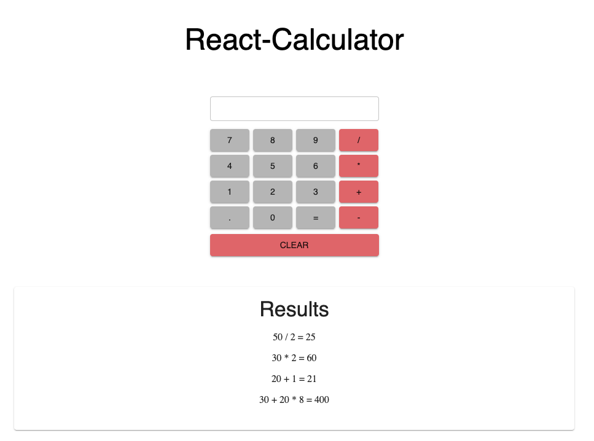

# React Calculator

## Description

A Basic calculator application built using React calculates the inputs logged  and displays the result on to DOM.

## Prerequisites

Before you get started, make sure you have the following software installed on your computer:

- [Node.js](https://nodejs.org/en/)
- [Nodemon](https://nodemon.io/)
- Redux
- Axios
- Sagas
- Express

## Wireframes

- Home page:

## Installation

1. Open your chosen code editor and run npm install.
2. You will also want to rum an npm install on react, redux, react-redux and material-ui.
3. In package.json add proxy and change the scripts to run server and client
``
"proxy": "http://localhost:5000",

``
`` "scripts": {
    "start": "node server/server.js",
    "client": "react-scripts start",
    "server": "nodemon --watch server server/server.js",
    "build": "react-scripts build",
    "test": "react-scripts test",
    "eject": "react-scripts eject"
  },``

4. Run `` npm run server `` in your terminal
5. Open another terminal and `` run npm run client ``

## Usage

1. Click on numbers you want to calculate and operator.
2. click on equals and it displays the results in the "Results"
3. Polling is set to display the result of another user's calculations.     Polling stops after 20 minutes, to reduce load on server

## Built With

- React
- Redux
- JavaScript
- HTML
- Express
- material-ui
- sagas

